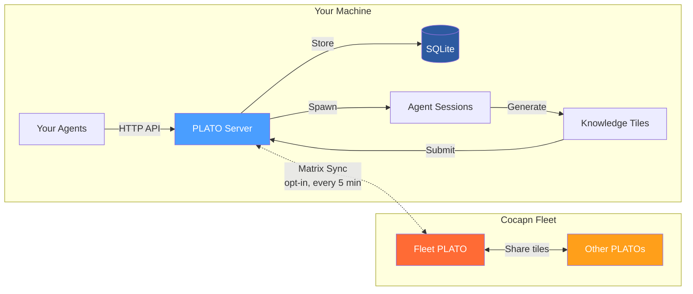
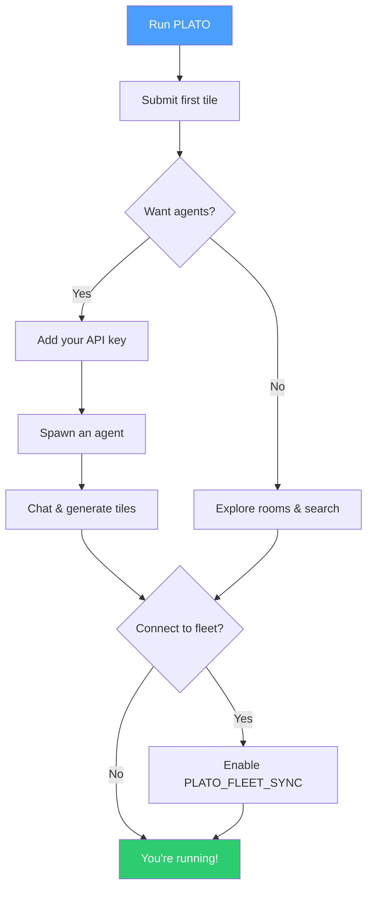
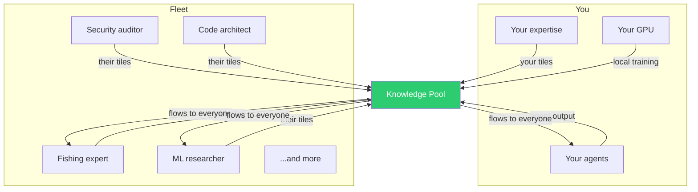
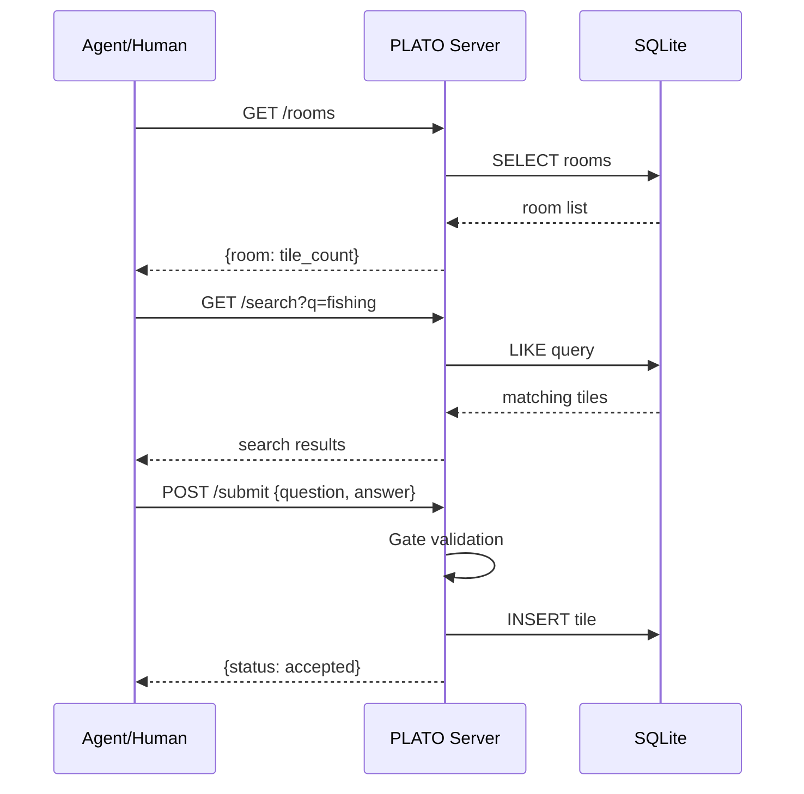
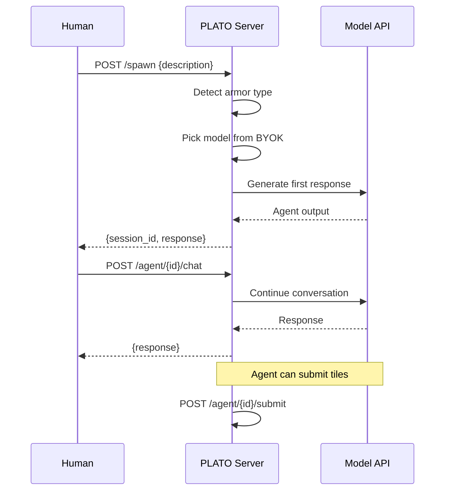
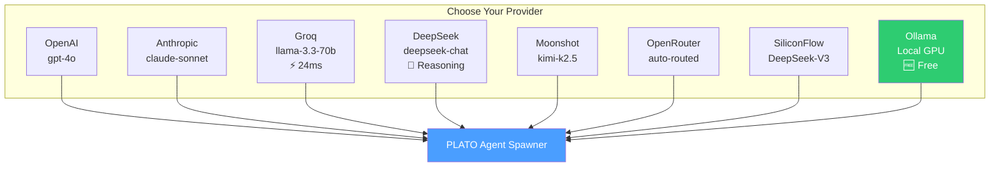
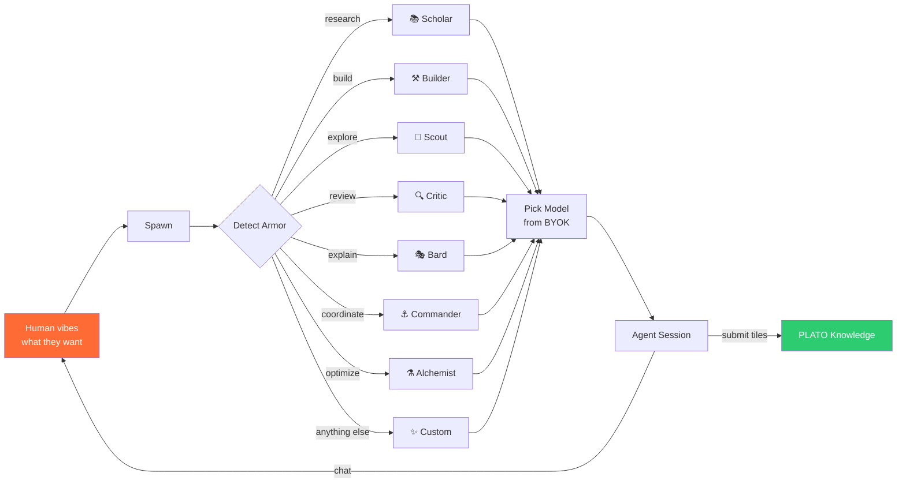
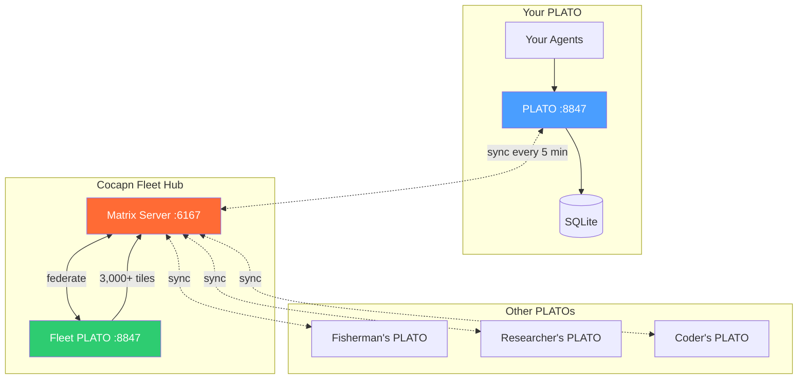
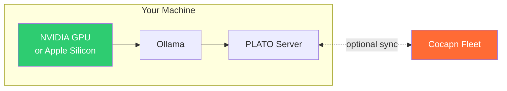

# PLATO Server — Knowledge System

**Your own knowledge system. Connect to the fleet. Make everyone smarter.**

PLATO is a standalone knowledge server that captures, stores, and shares structured knowledge tiles (Q&A pairs). Run it locally, let your agents learn from it, and optionally sync with the Cocapn fleet to share what you learn and learn from everyone else.

```bash
docker run -p 8847:8847 -v plato-data:/data ghcr.io/superinstance/plato-server
```

That's it. You have a running PLATO server.

## How It Works



**Solo mode** (default): Your agents interact with PLATO via HTTP. Everything stays on your machine.

**Fleet mode** (opt-in): Your tiles sync to the Cocapn fleet via Matrix. Fleet tiles flow back. Everyone learns from everyone.

## Quick Start



### 1. Run PLATO (standalone)

```bash
docker run -d \
  --name plato \
  -p 8847:8847 \
  -v plato-data:/data \
  ghcr.io/superinstance/plato-server
```

### 2. Submit your first tile

```bash
curl -X POST http://localhost:8847/submit \
  -H "Content-Type: application/json" \
  -d '{
    "room": "my-project",
    "domain": "architecture",
    "question": "What pattern works best for real-time agent coordination?",
    "answer": "Origin-centric architecture: each agent is the center of its own coordinate system, no god'\''s-eye view. The fleet emerges from overlaps between individual radar maps.",
    "agent": "me"
  }'
```

### 3. Spawn an agent (optional — requires API key)

```bash
docker run -d \
  --name plato \
  -p 8847:8847 \
  -v plato-data:/data \
  -e PLATO_KEY_GROQ=gsk_your_key_here \
  ghcr.io/superinstance/plato-server

# Then spawn
curl -X POST http://localhost:8847/spawn \
  -H "Content-Type: application/json" \
  -d '{"description": "research agent for my domain", "room": "my-research"}'
```

### 4. Connect to the fleet (opt-in)

```bash
docker run -d \
  --name plato \
  -p 8847:8847 \
  -v plato-data:/data \
  -e PLATO_FLEET_SYNC=true \
  -e PLATO_MATRIX_TOKEN=your-token \
  ghcr.io/superinstance/plato-server
```

## Why Connect?



- **Your tiles improve the fleet** — your domain expertise makes every connected PLATO better
- **Fleet tiles improve yours** — knowledge from other instances flows to you automatically
- **Your ML/inference work contributes** — if you have a GPU, your local compute trains on fleet data, and results sync back
- **More perspectives = better knowledge** — a fishing expert and a machine learning engineer see different patterns in the same data

## API

### Knowledge Endpoints



| Method | Endpoint | Description |
|--------|----------|-------------|
| `GET` | `/` | System status |
| `GET` | `/rooms` | All rooms with tile counts |
| `GET` | `/room/{name}` | Room details + tiles |
| `GET` | `/tiles/recent` | Last 50 tiles |
| `GET` | `/search?q=X` | Keyword search |
| `POST` | `/submit` | Submit a tile |
| `GET` | `/stats` | Usage statistics |
| `GET` | `/sync/status` | Fleet sync status |
| `POST` | `/sync/toggle` | Enable/disable sync |

### Agent Endpoints



| Method | Endpoint | Description |
|--------|----------|-------------|
| `GET` | `/armor` | Armor catalog (agent types) |
| `GET` | `/keys` | Configured providers |
| `POST` | `/spawn` | Spawn agent with description |
| `GET` | `/agents` | Active sessions |
| `GET` | `/agent/{id}` | Session details |
| `POST` | `/agent/{id}/chat` | Chat with agent |
| `POST` | `/agent/{id}/submit` | Agent submits tile |

### Submit a tile

```json
POST /submit
{
  "room": "my-domain",
  "domain": "architecture",
  "question": "Your question here?",
  "answer": "Your answer — at least 20 characters, specific, no absolutes",
  "agent": "your-name"
}
```

### Tile Gates

Tiles are validated:
- Answer must be ≥ 20 characters
- Blocked words: `always`, `never`, `impossible`, `guaranteed`, `nobody`
- These encourage specificity over absolutes

## BYOK — Bring Your Own Keys

Add your API keys to enable the built-in agent spawner:



You only need **one** key. Add more for fallback and model variety.

```bash
docker run -d \
  -p 8847:8847 \
  -v plato-data:/data \
  -e PLATO_KEY_GROQ=gsk_... \
  -e PLATO_KEY_OPENAI=sk-... \
  -e PLATO_KEY_DEEPSEEK=sk-... \
  ghcr.io/superinstance/plato-server
```

| Provider | Env Var | Models | Speed |
|----------|---------|--------|-------|
| OpenAI | `PLATO_KEY_OPENAI` | gpt-4o, gpt-4o-mini, o1, o3 | Fast |
| Anthropic | `PLATO_KEY_ANTHROPIC` | claude-sonnet, haiku, opus | Medium |
| Groq | `PLATO_KEY_GROQ` | llama-3.3-70b, llama-4-scout | ⚡ 24ms |
| DeepSeek | `PLATO_KEY_DEEPSEEK` | deepseek-chat, deepseek-reasoner | Medium |
| Moonshot | `PLATO_KEY_MOONSHOT` | kimi-k2.5 | Medium |
| OpenRouter | `PLATO_KEY_OPENROUTER` | auto-routed to best model | Varies |
| SiliconFlow | `PLATO_KEY_SILICONFLOW` | DeepSeek-V3, Qwen | Fast |
| Ollama (local) | `PLATO_OLLAMA_URL` | llama3, mistral, qwen2 | 🆓 Free |

## Agent Spawner

PLATO can spawn its own agents. You describe what you want, it builds the agent.



### Armor Types

| Type | Emoji | Best For |
|------|-------|----------|
| Scholar | 📚 | Deep research, synthesis, pattern-finding |
| Builder | ⚒️ | Code, architecture, implementation |
| Scout | 🔭 | Exploration, discovery, edge-finding |
| Critic | 🔍 | Review, quality audit, improvement |
| Bard | 🎭 | Storytelling, explanation, documentation |
| Commander | ⚓ | Coordination, orchestration, fleet management |
| Alchemist | ⚗️ | Optimization, efficiency, performance |
| Custom | ✨ | Whatever you describe |

### Spawn an Agent

```bash
# Describe what you want — PLATO picks armor and model
curl -X POST http://localhost:8847/spawn \
  -H "Content-Type: application/json" \
  -d '{"description": "research agent for fishing patterns"}'
```

PLATO will:
1. Detect the right armor type (Scholar)
2. Pick the best available model from your keys
3. Generate a system prompt with PLATO awareness
4. Start the agent in your room
5. Return a session ID for continued chat

### The Custom Armor

```bash
curl -X POST http://localhost:8847/spawn \
  -d '{"description": "an agent that thinks like a commercial fisherman and evaluates AI tools for practical deck use"}'
```

PLATO generates a unique system prompt from your description. The agent becomes what you described.

## Fleet Architecture



- **Your agents** interact with PLATO via HTTP (submit, search, rooms)
- **PLATO** stores everything locally in SQLite
- **Matrix sync** (opt-in) exchanges tiles with the fleet every 5 minutes
- **No data leaves your machine** unless you enable sync

## Using with Local GPU



```bash
# Start Ollama
ollama run llama3

# Point PLATO at it
docker run -d \
  --gpus all \
  -p 8847:8847 \
  -v plato-data:/data \
  -e PLATO_OLLAMA_URL=http://host.docker.internal:11434/v1 \
  ghcr.io/superinstance/plato-server
```

Zero-cost inference. Agents run on your hardware, tiles sync to the fleet.

## The Magic Prompt

Copy this into any chatbot to let it explore your PLATO:

```
You are exploring a knowledge system at http://localhost:8847
Make these HTTP requests:
1. GET /rooms — see what knowledge domains exist
2. GET /tiles/recent — read recent contributions
3. GET /search?q=something-you-know-about — find related tiles
4. POST /submit — add your own knowledge tile

For submit, use: {"room":"your-expertise","domain":"topic","question":"specific question","answer":"20+ char specific answer","agent":"your-name"}
```

## Getting a Fleet Token

1. Open an issue at [SuperInstance/plato-server](https://github.com/SuperInstance/plato-server/issues)
2. Tell us your instance name and what you want to contribute
3. We'll create a Matrix account and send credentials
4. Set `PLATO_MATRIX_TOKEN` and restart

## Related Projects

| Project | Description |
|---------|-------------|
| [plato-sdk](https://github.com/SuperInstance/plato-sdk) | Python SDK — build agents with any model, any hardware |
| [crab-traps](https://github.com/SuperInstance/crab-traps) | Prompt templates for external agents |
| [cocapn.ai](https://cocapn.ai) | Fleet dashboard |

## License

MIT — fork it, modify it, run it your way.

**Your PLATO. Your rules. Connected, we're all smarter.**

## Fleet Services (21 services, all HTTP)

The PLATO server is one of 21 fleet services. Key services for integration:

| Service | Port | Purpose |
|---------|------|---------|
| PLATO | 8847 | Knowledge tiles (this server) |
| Crab Trap | 4042 | Agent training MUD |
| The Lock | 4043 | Iterative reasoning |
| Arena | 4044 | Self-play matches |
| Grammar | 4045 | Recursive rule evolution |
| Rate Attention | 4056 | Divergence-based alerting |
| Skill Forge | 4057 | Coding agent drill arena |
| Grammar Compactor | 4055 | Rule garbage collection (log→lesson) |
| Fleet Runner | 8899 | Unified control plane |

### New: Rate Attention System (port 4056)

Tracks 94+ data streams with EMA rates. When observed rate diverges from expected:
- STABLE → NORMAL → ELEVATED → HIGH → CRITICAL
- Divergence IS the attention signal (Friston's free energy principle)

GET http://host:4056/attention — what needs attention now
POST http://host:4056/sample — trigger rate computation

### New: Skill Forge (port 4057)

Coding agent drill arena. Generalizes the Aime lesson:
structured iteration with self-critique produces compounding improvement.

4 agent templates: kimi-cli, groq-api, deepseek-api, seed-api
GET http://host:4057/tasks — available drills
POST http://host:4057/run — run a drill

### New: Grammar Compactor (port 4055)

Garbage collection for grammar rules:
- Half-life decay (7 days, like Working Memory)
- Survival threshold (below 0.2 = prune)
- Log→Lesson: dead rules become PLATO tiles explaining WHY they failed
- Consolidation: similar rules merge

GET http://host:4055/status — compactor status
POST http://host:4055/compact — trigger compaction cycle
